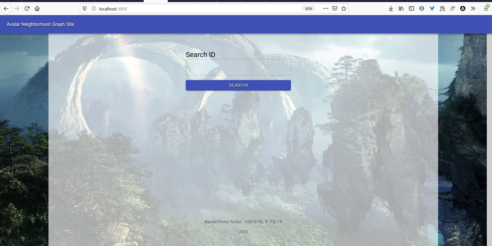
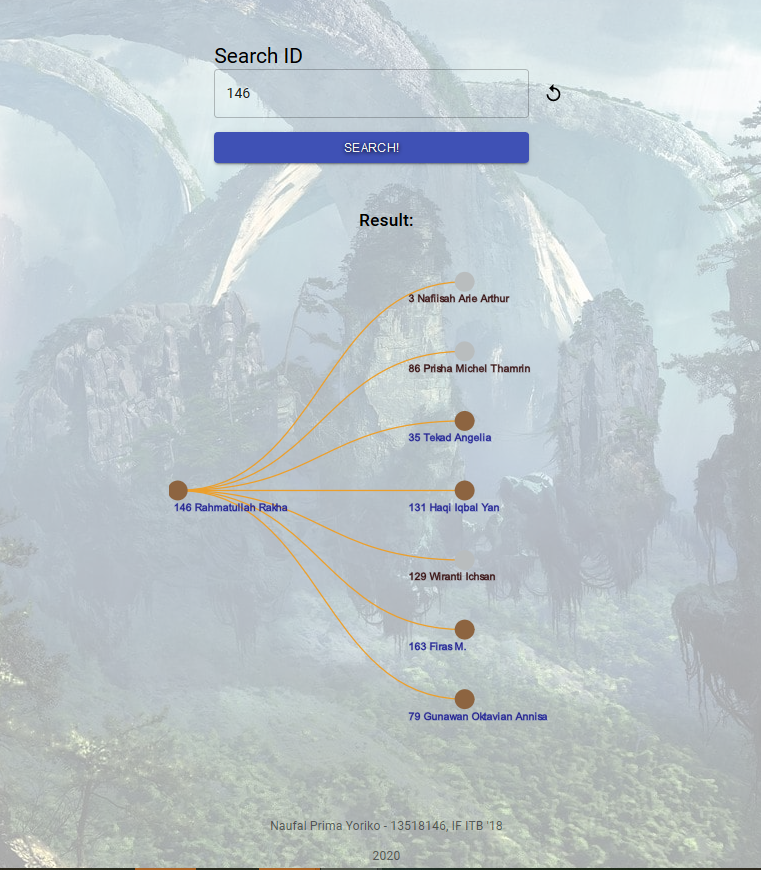
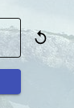
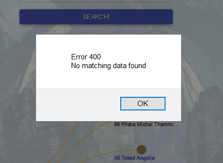

# Avatar-Neighborhood-Graph
Avatar neighborhood graph implemented with React and Material UI and fetch data from web API from https://avatar.labpro.dev/friends/{id}.
This project has been deployed [here](https://avatar-graph-146.herokuapp.com/) with Heroku.

This web app created by [Naufal Prima Yoriko](https://github.com/primayoriko/), currently studying in [Institut Teknologi Bandung](http://itb.ac.id/) at Informatics Engineering with Student ID/NIM 13518146.

## Requirements & Dependencies
--------------
Applications:
1. [Node js](https://nodejs.org)
2. [npm](https://npmjs.com)

Libraries & Frameworks:
1. [React JS](https://reactjs.org) v16.13.1 then created with create-react-app
2. [Material UI](https://material-ui.com) with core v.4.10.2, icons v.4.9.1, system v4.9.14
3. [React Tree Graph](https://www.npmjs.com/package/react-tree-graph) v4.1.1
4. For deploying on Heroku purpose, I used [heroku-cra-node](https://github.com/mars/heroku-cra-node) as the build pack.

## How to run in local
--------------------
1. Install all of the applications needed that I've mentioned above
2. Download the repo then open it
3. Open teminal in this directory
4. For your first run, execute
   
        npm install

5. Then you can execute

        npm start

6. Look at the terminal, and wait until it's redirect you into your local server
7. If you could see the GUI of the web, then It's finish and ready to use
   

## How to use the apps
-----------------------
1. In the text field from the web, you can try to input **ID** of the person (so it should be a number).
2. After that, you can hit the *SEARCH!* button and wait for a while, as the program fetching data from the API.
3. If nothing gone wrong (and the ID is valid), you could see the graph appear and you could see the relation of the people with the person that you wrote his/her ID.
   
4. You can try to click at the node, to fetch data from his/her ID in the API server, then if nothing gone wrong, the new graph should be shown.
5. There is revert button too, if you want to erase the graph result that have been shown.
   
6. If there is something wrong, there should be shown a message box to let you know what is the problem.
7. 

## About The App
-------------
1. This app have a text field and a button that used as search engine to fetch data from the API server.
2. The result will be shown as a graph (or you could say it a tree, too) that every person representated as a node, and link between them symbolize that they're connected.
3. There is identity at every node that consists of the person's ID and name.
4. Color of the node symbolize their element, where orange is fire, blue is water, brown is earth, and grey is air element. 

## API Review
-------------------
1. Actually, I didn't found any technical bug of the API. But, 
2. I think there are some logical bugs according to description of the question/problem. If this API represent relation of someone with their friend(s), it shouldn't:
    * Can be friended with themself (So, if parent is ID 1, there shouldn't be any friends with ID 1).
    * There are duplicates in the friends data (for example someone with ID 1     could have 2 friend's node with same ID that have number of 5).
    * Actually, I wondered too, why some of the relations are one-sided (A being friend with B, but not otherwise).

    I'm try to solve this by making filter function to filter the data before It's shown. But, I think it would be  better if the server resolve the problem by implementing filter in the server-side, so data from the API have been cleaned.

